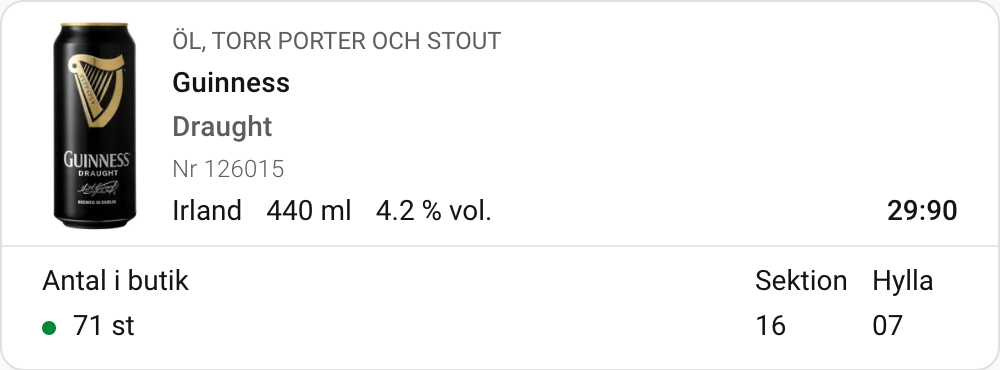

# Home Assistant Systembolaget Card



A custom Home Assistant card for using the API proxy to display the current
stock of a product at a specific store.

Note that this is mostly intended as an example use of the project. Breaking
changes may occur without further notice. Redoing the installation as documented
below should suffice to update to the latest version.

## Installation

### API Proxy

The card uses the API proxy in `cmd/proxy`. It's subject to change. The proxy
can be built and run on host or using Docker, just like the main `systembolaget`
binary.

### Home Assistant

Copy [systembolaget-stock-card.js](./systembolaget-stock-card.js) to your Home
Assistant installation's `www` directory. If it doesn't exist, create it.

Next, in the Home Assistant UI, configure additional resources for dashboards,
adding the path `/local/systembolaget-stock-card.js` to the list of resources.

## Using the card

The card will show up in the dashboard configuration like any other card. It
takes the following configuration:

```yaml
type: custom:systembolaget-stock-card
apiUrl: http://x.y.z.w:8080/api/v1
storeId: 0102
productId: 507849
```
